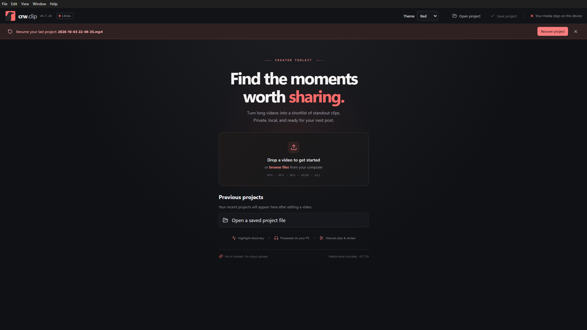
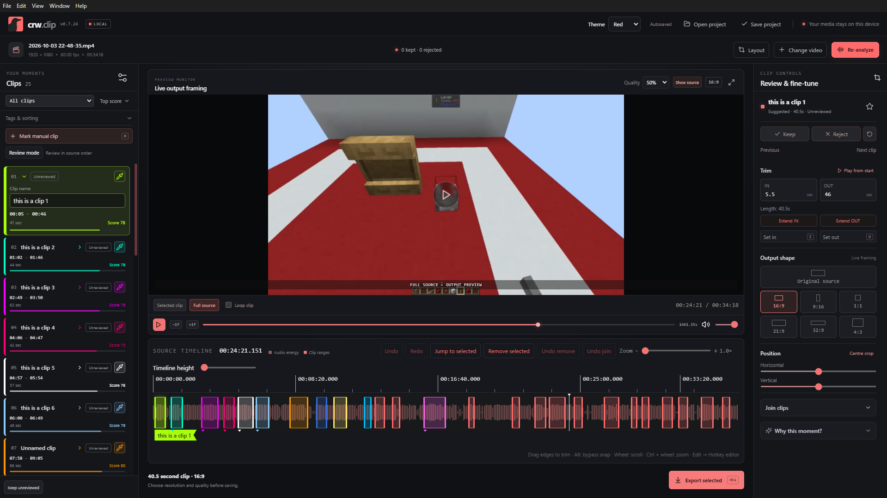
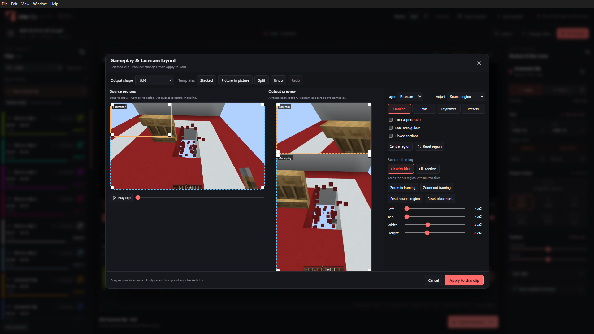

# User guide — v0.7.24

[Return to README](../README.md)

## 1. Open a recording

Launch the portable Windows executable. Drop a local video onto the welcome screen or browse for one. You can also open a saved `.clipproject` file or choose a previous project.

**Clear recent projects** clears the welcome-screen list without deleting saved projects, recovery data, or source videos.

Common import extensions include MP4, MKV, MOV, WEBM, and AVI. Successful preview depends on the codecs inside the file; use H.264 MP4 when possible.

## 2. Find moments

Click **Analyze video**. Open the settings icon beside **Your moments** to open the Detection controls popout. It provides Analyze, Re-analyze when applicable, and Apply cached signals, along with:

- **Analysis mode:** Audio + visual, Audio only (faster), or Visual only.
- **Audio and visual sensitivity:** Higher settings find smaller changes.
- **Suggestion limit:** Request between 1 and 200 new suggestions.
- **Minimum event duration:** Ignore brief events.
- **Minimum/maximum clip duration:** Control suggestion lengths.
- **Before/after padding:** Include context around detected events.

Use **Apply cached signals** to rerank existing analysis when the required signals are available. Changing analysis modes may require a new scan. Re-analysis preserves manual, reviewed, favourite, named, and colour-tagged clips, and clips with gameplay/facecam layouts; their existing scores may remain unchanged. New suggestions avoid overlapping each other and preserved clips, so the requested count is a limit, not a guarantee.

Scores favour stronger audio changes and visual activity. A scene change alone does not establish that a moment is interesting.

## 3. Review and organise

Click a clip card or a timeline highlight to select it. Timeline selection reveals the matching sidebar card; filters clear only if they hide that clip.

Use **Keep**, **Reject**, or the reset icon. Favouriting a clip also marks it Keep. You can filter by review state or favourites, sort by score, and expand **Tags & sorting** for colour controls.

Choose **Review mode** to work through unreviewed clips in source order. Each preview includes up to two seconds before and after the clip. Keep or Reject advances to the next unreviewed clip. Review stops when all clips have decisions. The extra preview context is not added to exported clip boundaries.

### Names and colours

Cards stay compact until selected; the selected card expands and the previous card collapses. Use **Clip name** on the expanded card to rename it. Exported files use that name, with filename-safe substitutions and suffixes where needed to avoid collisions.

The eyedropper opens the colour picker; right-click it to clear the colour. A chosen colour overrides the theme for the timeline highlight, name flag, sidebar selection, name field focus, eyedropper, score text, and score bar. Named, unselected clips show a small notch below the highlight. Selecting one opens its full name flag with a 3 px gap.

## 4. Trim and navigate

Select a clip, then drag either timeline edge at any point along its height. A precise time readout appears during the drag. Edges snap near the playhead; hold **Alt** to bypass snapping.

In **Clip Controls**, enter IN/OUT times in seconds, set boundaries at the playhead, or use **Extend IN / Extend OUT** to add one second before/after the clip. Invalid or zero-length ranges are prevented.

- **Wheel:** Scroll the source timeline when zoomed in.
- **Ctrl + wheel:** Zoom the timeline; the modifier can be changed in the hotkey editor.
- **Jump to selected:** Bring the selected range into the timeline viewport.
- **Timeline height:** Change the highlight/waveform height.
- **Selected clip / Full source:** Change playback bounds.
- **Loop clip:** Repeat selected-clip playback outside review mode.
- **Frame buttons:** Step through the video one frame at a time.

Use **Mark manual clip** to create a clip around the playhead. Manual clips can intentionally overlap.

### Undo, joining, and removal

Use Undo/Redo or their keyboard shortcuts for clip edits. Undo history is session-based, holds up to 100 changes, and resets when another video/project is loaded. A trim drag is one undo step.

Expand **Join clips** in Clip Controls to join the previous or next chronological clip. The resulting range includes any gap, uses the selected clip's framing, and is marked Keep. **Undo last join** restores the originals. Recorded join history is stored in saved projects.

**Remove selected** deletes a clip from the moments list. Undo or **Undo remove** can restore it during the session. Re-analysis may suggest a removed moment again.

## 5. Preview and frame the output

Click anywhere inside the video preview to play or pause. Drag the source timeline or transport track to scrub with live decoded frames.

Choose **Quality** above the preview: **25%, 50%, 75%, or 100%**. Lower settings prepare smaller local H.264 preview files, reused on subsequent visits. The original remains available during preparation. Switching preserves playback position and playing/paused state; it waits until active scrubbing, trimming, or layout editing finishes. Choose 100% to restore the original. This setting is remembered on this computer and does not change export quality.

Preparation pauses during analysis/export. Older proxies are removed toward a 2 GiB cache budget; the newest prepared proxy is retained even if it exceeds that budget. Failed preparation returns to the original. The layout editor's output preview also follows the quality setting.

Select **Original source**, **16:9**, **9:16**, **1:1**, **21:9**, **32:9**, or **4:3** under Output shape. Use the horizontal and vertical Position sliders, or **Centre crop**, to frame the clip. The output monitor previews the crop; **Show source** displays the uncropped source.

### Gameplay & facecam layouts

Click **Layout**, immediately before Change video. Select the gameplay and facecam regions in the source, then arrange their output boxes. Drag regions to move them and corners to resize. Regions snap to the centre; hold Alt to bypass snapping.

The previews stay beside four control tabs:

- **Framing:** Select the layer and source/output region. Use Centre region, proportional resizing with Lock aspect ratio, and Linked sections with a shared divider. Fit with blur keeps the full region; Fill section crops excess edges. Source-region zoom/pan changes framing without moving the output box. Reset source region and Reset placement work separately.
- **Style:** Choose blurred-video or solid-colour backgrounds, blur strength/brightness, and independent borders, border colours, and rounded corners. Safe-area guides are preview aids and are not exported.
- **Keyframes:** Move the preview to a time, frame the selected layer's source region, and add a framing keyframe. Repeat to animate pan/zoom. Times are relative to clip start; the first keyframe sets the crop aspect ratio. Framing holds before the first and after the last keyframe. This is manual keyframing, not automatic tracking.
- **Presets:** Save a named layout on this computer, reuse or delete presets, and check additional clips to receive the layout when applying. Keys beyond a shorter copied clip's duration remain saved but are not reached.

Undo/Redo inside the editor includes output-shape changes. Cancel discards the draft; Apply saves the layout for this clip and any checked clips. Applied layouts update the main output preview and exports. While a clip has a layout, change its output shape inside the Layout editor; the main Output shape and Position controls are disabled.

## 6. Export

Click **Export selected**, then choose:

- Resolution: **Original source, 720p, 1080p, or 2160p**.
- Quality: **High quality, Balanced, or Smaller file**.
- Optional **Also export all kept clips**.

Without the checkbox, choose a file location for the selected clip. With it, choose a folder for the selected clip plus all kept clips. The selected clip is included once, and does not need to be marked Keep. Exporting does not change review decisions.

**Original source resolution** with Original source shape retains the full frame, adding at most one edge pixel for even MP4 dimensions. With a fixed shape, it exports the native crop without upscaling; layout clips use a source-sized canvas and resize their layers. Numeric resolution presets preserve the chosen shape, including ultrawide and portrait output. Preview proxies are never used as export inputs.

Exports are H.264 video with AAC audio when available, in MP4 files. The queue shows individual and overall progress. Cancelling preserves completed clips and removes unfinished output. Higher output resolutions do not restore detail absent from the source.

## 7. Save your work

Use **Save project** to save edit decisions and analysis. Autosave also maintains session recovery, and the welcome screen offers previous projects. Source videos are not copied into projects. Keep the original video at its saved path.

## Default shortcuts

Change these under **Edit → Hotkey editor**. Existing customised shortcuts may differ. While typing in a field, normal text editing takes precedence.

| Action | Default |
| --- | --- |
| Play / pause | Space |
| Seek 1 second | Left / Right arrow |
| Seek 5 seconds | Shift + Left / Right arrow |
| Previous / next frame | Comma / Period |
| Mark manual clip | M |
| Set IN / OUT at playhead | I / O |
| Keep / Reject / Reset | K / R / U |
| Remove selected | Delete |
| Undo / Redo | Ctrl + Z / Ctrl + Shift + Z |
| Undo join | Ctrl + J |
| Jump to selected | F |
| Zoom in / out | Ctrl + = / Ctrl + - |
| Export selected | Ctrl + E |
| Save / Open project | Ctrl + S / Ctrl + O |
| Timeline wheel zoom | Ctrl + mouse wheel |

## Troubleshooting

**Preview cannot decode:** Try an H.264 MP4 source. Importable file extensions do not guarantee preview codec support.

**Too few suggestions:** Raise sensitivity, reduce the minimum event duration, or try combined analysis. Preserved clips and overlapping candidate ranges can reduce the count.

**A project cannot find its video:** Restore the source to its original saved path. Projects do not include the source footage.

**Unexpected crop:** Switch back to output preview and check the aspect ratio and Position sliders before exporting.

**A score did not change after re-analysis:** Reviewed, manual, favourite, named, colour-tagged clips and clips with layouts are preserved. New unreviewed suggestions use the current scoring.
